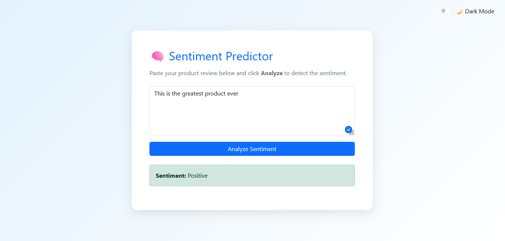
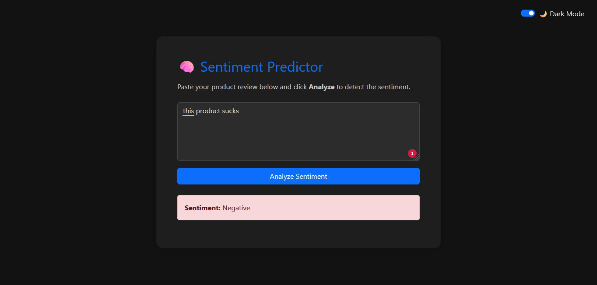

```markdown
# 🧠 Sentiment Analysis Flask App [](https://colab.research.google.com/drive/1Hk4JXwBJHod5Nu3jI3KW1tr22HRBXce0?usp=sharing)

A **Flask-based web application** that performs real-time sentiment analysis on product reviews using:

- **SentenceTransformer** (`all‑MiniLM‑L6‑v2`) for text embeddings
- **Logistic Regression** model for sentiment classification
- A polished **Bootstrap UI** with light/dark modes and loading spinner

---

## 📸 Preview

| Light Mode                               | Dark Mode                              |
| ---------------------------------------- | -------------------------------------- |
|  |  |

---

## 📂 Project Structure
```

Sentiment-api/
├── app.py # Main Flask server
├── logistic_model.pkl # Pre-trained sentiment classification model
├── templates/
│ └── index.html # Web UI with Bootstrap, dark-mode toggle, and spinner
├── requirements.txt # Python dependencies
└── .gitignore # Ignore virtual environments, cache, PKL, etc.

````

---

## 🚀 How to Download & Run Locally

### 1. Clone the repository

```bash
git clone https://github.com/Surfing-Cipher/Sentiment_Analysis.git
cd Sentiment_Analysis
````

### 2. Configure environment (Python 3.8+ recommended)

```bash
python -m venv venv
# On Windows:
venv\Scripts\activate
# On macOS/Linux:
source venv/bin/activate
```

### 3. Install dependencies

```bash
pip install -r requirements.txt
```

### 4. Run the app

```bash
python app.py
```

Visit [http://127.0.0.1:5000](http://127.0.0.1:5000) in your browser.

---

## 🎯 Features

- **Real-time sentiment analysis**
- **Responsive Bootstrap UI**
- **Light/dark mode toggle**
- **Loading spinner for prediction**
- Clean layout and improved readability

---

## 🤝 Contributing

- Open issues or PRs for bugs/features
- Follow existing UI/UX conventions
